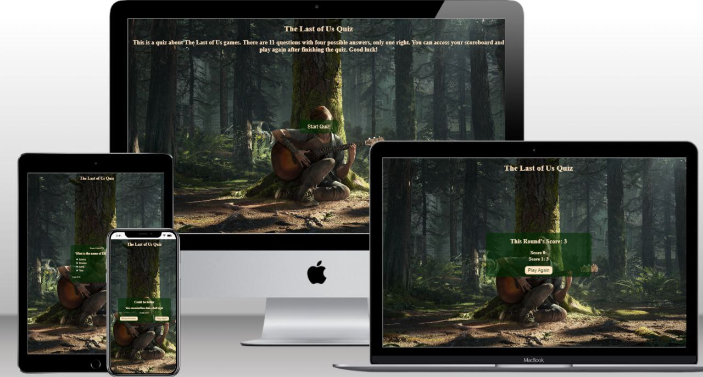
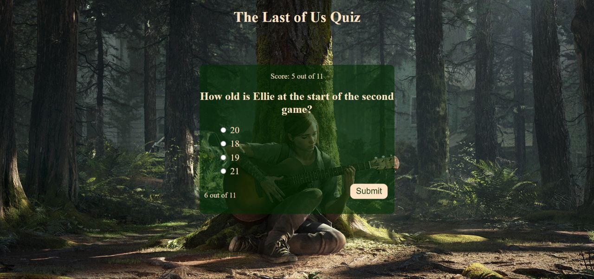

# The Last of Us Quiz



The Last of Us Quiz is a site that gives fans an opportunity to test their knowledge of the games.

The live link can be found here - https://pozhara.github.io/The-Last-of-Us-Quiz/

Cloned link of github repository - https://github.com/pozhara/The-Last-of-Us-Quiz.git

# Existing features

## Start Quiz

Includes a start quiz button and an explanation to not throw people directly to the quiz.


## The quiz itself
Includes questions, answers, submit button, progress indicator and score so people wouldn't guess how much more questions they have to answer and if they answered correctly.


## Results
Includes a message of people's performance, how many question they answered correctly, a button to play again that refreshes the page and a button to access a scoreboard.


## Scoreboard
Includes all scores and a button to play again that refreshes the page.


# Testing
The site looks good on different screens. Image isn't distorted. Javascript code works as expected to make the quiz playable and responsive.

-HTML: No errors were returned when passing through the official W3C validator


-CSS: No errors were found when passing through the official (Jigsaw) validator


-JS: No errors were found when passing through a JavaScript validator


## Manual tests

I clicked on the start button and the first question was immediately loaded.

I answered correctly and saw my score go up and progress indicator increase when I clicked for next question.

I got the results I expected with the amount of correct answers I got.

I clicked scoreboard button and saw all my previous attempts as well as the most recent score at the top. 

I clicked play again button and the page refreshed to the page with start button and an explanation.

I resized the page to check responsiveness and all elements were adjusted accordingly.

# Bugs

I had a problem with shuffling answer. Tried using Math.random() and googling but still couldn't figure out how to do it. At the end I had to ask on Stack Overflow and got the answer.

Using local storage was challenging for me. Most YouTube videos only showed the basics so I had to go deeper to find a video where a person actually shows how to implement it to a webpage.

In the earlier version of my webpage it had a "This round's score:" on top of the scoreboard page but when I added this code:

```
scoreDetail.map((items, index) => {
            userScoreTemplate += `<h3>Score ${index}: ${items}</h3>`;
            if (items==""){
                userScoreTemplate="";
            };
        });
```

Specifically the if fucntion, the sentence stopped appearing.

# Deployment

The site was deployed to GitHub pages. The steps to deploy are as follows:

-In the GitHub repository, navigate to the Settings tab

-From the source section drop-down menu, select the Master Branch

-Once the master branch has been selected, the page will be automatically refreshed with a detailed ribbon display to indicate the successful deployment

The live link can be found here - https://pozhara.github.io/The-Last-of-Us-Quiz/

Cloned link of github repository - https://github.com/pozhara/The-Last-of-Us-Quiz.git

# Credits

## Content
Questions and answers for the quiz are from two webpages: useapotion and pushsquare (url: https://www.useapotion.com/2022/08/quiz-how-well-do-you-know-the-last-of-us/ , https://www.pushsquare.com/quizzes/how-well-do-you-know-the-last-of-us)

## Media

The background image was taken from Alpha Coders website (url: https://wall.alphacoders.com/by_sub_category.php?id=251477&name=The+Last+of+Us+Part+II+Wallpapers)

## Code

To make a quiz on my own I had to watch walkthrough videos. Like:

Web Dev Simplified (url:https://www.youtube.com/watch?v=riDzcEQbX6k&t=1435s)

Keep coding (url:https://www.youtube.com/watch?v=MxrGPP4F8Sc&t=2700s)

Brian design (url:https://www.youtube.com/watch?v=f4fB9Xg2JEY&t=2423s)

Keith Paterson (url:https://www.youtube.com/watch?v=79WRPIknVHs&t=2697s)

The template way of writing a quiz in JavaScript was taken from Просто: разработка (url:https://www.youtube.com/watch?v=kl4lJ3-qt6k)

A way of shuffling answers was taken from Stack Overflow (url: https://stackoverflow.com/questions/74492512/shuffled-answers-are-repeating-in-a-quiz/74493507#74493507)

To understand how local storage works I've watched Max Programming's video (url: https://www.youtube.com/watch?v=U693xrQKFy4)